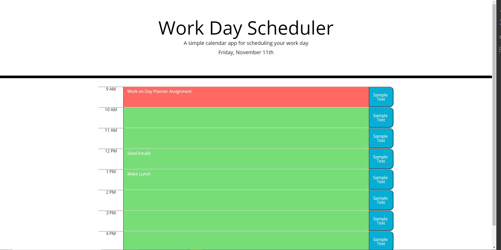

# DayPlanner

## Description:
This is an HTML application that functions as a one day planner. It allows you to save and edit events in time blocks. The application also updates the coloring of the time blocks to show the current hour and those in the past and present.

## Screenshot:

## Link:
Repository: https://github.com/sziccardi1998/DayPlanner

Hosted Application: https://sziccardi1998.github.io/DayPlanner/ 